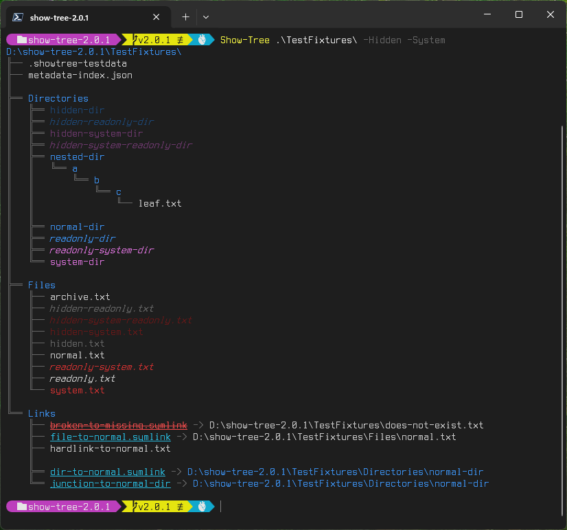
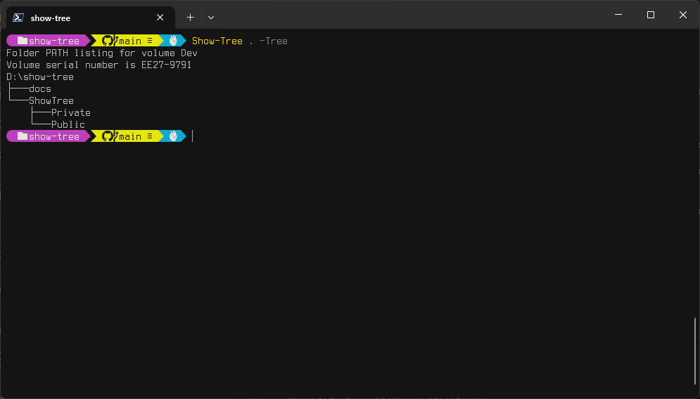
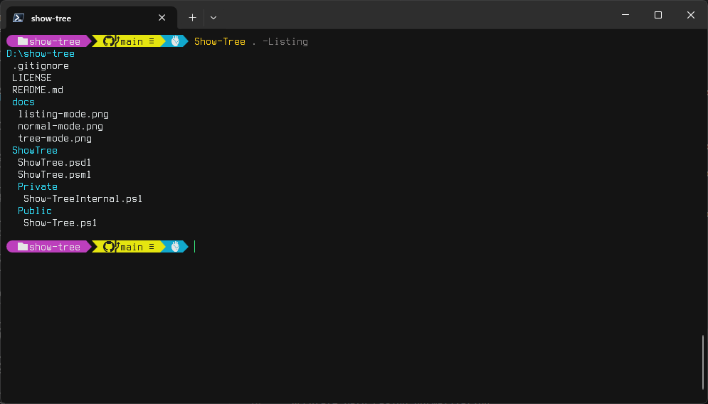

# ShowTree

[](https://www.powershellgallery.com/packages/ShowTree)
[](https://www.powershellgallery.com/packages/ShowTree)

A modern, PowerShell-native replacement for the classic `tree.com` command — redesigned for clarity, correctness, and modern workflows.

ShowTree provides three display modes:

- **Normal mode** (default): graphical Unicode tree with color, files, and depth control  
- **Tree mode** (`-Mode Tree`, ~~`-Tree`~~): faithful DOS `tree.com` compatibility  
- **Listing mode** (`-Mode List`, ~~`-List`~~): compact, indentation-only output ideal for piping, grepping, and exporting  

---

## Why ShowTree?

`tree.com` hasn't changed since the 1990s — but your filesystem has.

ShowTree adds:

- Unicode connectors for clean, readable output  
- Color support with attribute-aware styling  
- Depth control and recursion shortcuts  
- Glob-based include/exclude filtering with exact/glob precedence rules
- Hidden/system filtering that matches `tree.com` in Tree mode
- Reparse point detection and optional target display  
- Gap logic for visually separating blocks  
- A compact listing mode for automation  

All implemented in pure PowerShell with no external dependencies.

---

## Features

- Graphical Unicode tree with color syntax and clean connectors  
- ASCII fallback for legacy environments  
- Full `tree.com` compatibility mode  
- Compact listing mode for scripts and automation  
- Depth control (`-MaxDepth`, `-Depth`, `-Recurse`)  
- File inclusion/exclusion (`-Files`, `-NoFiles`)  
- Gap control for readability (`-NoGap`)  
- Glob-based include/exclude filtering with exact/glob precedence rules
- Hidden/System filtering with Include override support
- Reparse point target display (`-ShowTargets`)  
- Works on NTFS, ReFS, FAT, and UNC paths  

---

## Screenshots

### Normal Mode



### Tree Mode



### Listing Mode



---

## Installation

### From [PowerShell Gallery](https://www.powershellgallery.com/packages/ShowTree) (recommended)

```powershell
Install-Module ShowTree
```

PowerShell will auto-load the module when you run:

```powershell
Show-Tree
```

### From GitHub

Clone the repository and place the `ShowTree` folder into one of your module paths:

- Current user:  
  `~/Documents/PowerShell/Modules/`

- All users:  
  `C:\Program Files\PowerShell\7\Modules\`

---

## Usage

### Basic usage

```powershell
Show-Tree
```

### Show only directories

```powershell
Show-Tree -NoFiles
```

### Unlimited depth

```powershell
Show-Tree -Recurse
```

### DOS `tree.com` compatible mode

```powershell
Show-Tree -Mode Tree
```

### Compact listing mode

```powershell
Show-Tree -Mode List
```

### ASCII connectors

```powershell
Show-Tree -Ascii
```

---

## Filtering (Include / Exclude)

ShowTree supports PowerShell-style glob filtering with well-defined precedence
rules. Filtering is applied after enumeration but before rendering, and always
preserves the original item order.

### Exclude

```powershell
-Exclude pattern1, pattern2, ...
```

Removes matching items. Exact matches take precedence over Include globs.

### Include

```powershell
-Include pattern1, pattern2, ...
```

Selectively resurrects items removed by Hidden, System, or Exclude (glob).

### Precedence Rules

1. Exact Include always wins
2. Exact Exclude always wins (even over glob Include)
3. Glob Include resurrects items removed by Hidden/System/Exclude (glob)
4. Hidden/System remove items unless resurrected
5. Glob Exclude removes items unless resurrected
6. Items unaffected by any rule are kept

### Hide everything starting with a dot except `.vscode`

```powershell
Show-Tree -Exclude '.*' -Include '.vscode'
```

### Exclude `.git` exactly, but include `.gitignore`, `.github`, etc.

```powershell
Show-Tree -Exclude '.git' -Include '.git*'
```

### Hide hidden/system items but bring back `.config`

```powershell
Show-Tree -HideHidden -HideSystem -Include '.config'
```

---

## Parameter Summary

| Parameter | Description |
| --------- | ----------- |
| `-Mode Normal|Tree|List` | Selects the output mode. Replaces `-Tree` and `-List`. |
| ~~`-Tree`~~ | Deprecated. Use `-Mode Tree`. |
| ~~`-List` / `-Listing`~~ | Deprecated. Use `-Mode List`. |
| `-MaxDepth` / `-Depth` | Maximum recursion depth (`-1` = unlimited). |
| `-Recurse` | Shortcut for unlimited depth. |
| `-Mono` | Disable color. |
| `-Color` | Force color output. |
| `-Files` | Show files (Tree mode default). |
| `-NoFiles` | Hide files. |
| `-HideHidden` / `-ShowHidden` | Control visibility of hidden items. |
| `-HideSystem` / `-ShowSystem` | Control visibility of system items. |
| `-Include` | Glob patterns that explicitly include items. Exact matches override all other filters. |
| `-Exclude` | Glob patterns that remove items. Exact matches override Include (glob). |
| `-ShowTargets` / `-NoTargets` | Show or hide reparse point targets. |
| `-NoGap` | Disable gap lines. |
| `-Ascii` | Use ASCII connectors instead of Unicode. |
| `-DebugAttributes` | Show attribute debug info. |

---

## Examples

Display the current directory:

```powershell
Show-Tree
```

Tree.com-style output:

```powershell
Show-Tree -Mode Tree
```

List everything under C:\ with unlimited depth:

```powershell
Show-Tree C:\ -Recurse
```

Compact listing for scripting:

```powershell
Show-Tree -Mode List | Select-String src
```

Export to a file:

```powershell
Show-Tree C:\ -Mode List | Out-File listing.txt
```

---

## Testing

Install Pester 5.7.1 or better:

```powershell
Install-Module -Name Pester -Force -MinimumVersion 5.7.1
```

From the repo root, run:

```powershell
.\ShowTree\Tests\RunTests.ps1
```

---

## Deprecation Notice

The legacy switches `-Tree` and `-List` are still supported for backward compatibility but are now deprecated.  
Use the unified `-Mode` parameter instead:

```powershell
-Mode Normal
-Mode Tree
-Mode List
```

---

## License

This project is licensed under the MIT License. See the LICENSE file for details.

---

## Author

**Ryan Beesley**  
Version 1.2.1  
April 2026

A modern, extensible reimplementation of the classic `tree.com` utility — with graphical output, automation-friendly modes, and a fully PowerShell-native design.
