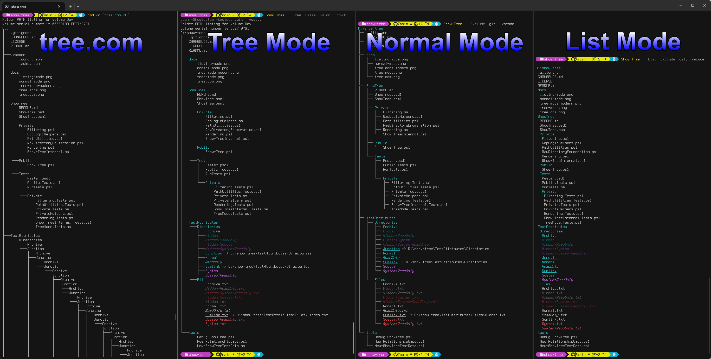

# ShowTree

[](https://www.powershellgallery.com/packages/ShowTree)
[](https://www.powershellgallery.com/packages/ShowTree)

A modern, PowerShell-native replacement for the classic `tree.com` command — redesigned for clarity, correctness, and modern workflows.

ShowTree provides three display modes:

- **Normal mode** (default): graphical Unicode tree with color, files, and depth control  
- **Tree mode** (`-Mode Tree`, ~~`-Tree`~~): faithful DOS `tree.com` compatibility  
- **Listing mode** (`-Mode List`, ~~`-List`~~): compact, indentation-only output ideal for piping, grepping, and exporting  

---

## Why ShowTree?

`tree.com` hasn't changed since the 1990s — but your filesystem has.

ShowTree adds:

- Unicode connectors for clean, readable output  
- Color support with attribute-aware styling  
- Depth control and recursion shortcuts  
- Glob-based include/exclude filtering with exact/glob precedence rules
- Hidden/system filtering that matches `tree.com` in Tree mode
- Reparse point detection and optional target display  
  - Legacy `tree.com` can follow Junctions and Symlinks recursively
  - ShowTree in Tree Mode has depth control and shows link targets
- Gap logic for visually separating blocks  
- A compact listing mode for automation  

All implemented in pure PowerShell with no external dependencies.

---

## Features

- Graphical Unicode tree with color syntax and clean connectors  
- ASCII fallback for legacy environments  
- Full `tree.com` compatibility mode  
- Compact listing mode for scripts and automation  
- Depth control (`-MaxDepth`, `-Depth`, `-Recurse`)  
- File inclusion/exclusion (`-Files`, `-NoFiles`)  
- Gap control for readability (`-NoGap`)  
- Glob-based include/exclude filtering with exact/glob precedence rules
- Hidden/System filtering with Include override support
- Reparse point target display (`-ShowTargets`)  
- Works on NTFS, ReFS, FAT, and UNC paths  

---

## Platform Support

PowerShell 5.1+ on Windows and PowerShell 7+ on Linux/macOS: Normal and Listing modes are expected to work, but cross-platform support is still being validated. Tree mode emulates low-level Windows `tree.com` behavior and is likely to only be supported on Windows.

| Platform | Normal mode | Listing mode | Tree mode |
| -------- | ----------- | ------------ | --------- |
| Windows PowerShell 5.1 | Supported | Supported | Supported |
| PowerShell 7+ on Windows | Supported | Supported | Supported |
| PowerShell 7+ on Linux | Supported | Supported | Not supported |
| PowerShell 7+ on macOS | Supported | Supported | Not supported |

---

## Screenshots

### High level view of modes



### Normal Mode

  
Normal mode is the standard way to use `Show-Tree`. It provides granular control and makes it a modern interpretation for `tree.com` for PowerShell.

### Legacy `tree.com` is broken

  
`tree.com` will follow all Junctions and Symlinks, and doesn't limit depth. This can get stuck in an unlimited recursion.

### Tree Mode (legacy backwards compatibility)

  
Tree mode follows the output and error messages of `tree.com` very closely. It also defaults to handle files the same way, but it can be customized.

### Tree Mode (modern)

  
`Show-Tree . -Files` is the equivalient to `tree.com . /F`, but `-ShowHidden`, `-ShowSystem`, `-Color`, and other options give you a mode which retains the look and feel of a modern `tree.com`. By showing link targets and not following them, `Show-Tree` resolves one of the biggest problems with `tree.com` on modern systems.

### Listing Mode

  
Listing mode gives you a tight listing of the files and directories on a system. It benefits the most from having color enabeled to see folders and files at a glance, and minimally shows the tree structure, making it an ideal mode for downstream processing.

---

## Installation

### From [PowerShell Gallery](https://www.powershellgallery.com/packages/ShowTree) (recommended)

```powershell
Install-Module ShowTree
```

PowerShell will auto-load the module when you run:

```powershell
Show-Tree
```

### From GitHub

Clone the repository and place the `ShowTree` folder into one of your module paths:

- Current user:  
  `~/Documents/PowerShell/Modules/`

- All users:  
  `C:\Program Files\PowerShell\7\Modules\`

---

## Usage

### Basic usage

```powershell
Show-Tree
```

### Show only directories

```powershell
Show-Tree -NoFiles
```

### Unlimited depth

```powershell
Show-Tree -Recurse
```

### DOS `tree.com` compatible mode

```powershell
Show-Tree -Mode Tree
```

### Compact listing mode

```powershell
Show-Tree -Mode List
```

### ASCII connectors

```powershell
Show-Tree -Ascii
```

---

## Filtering (Include / Exclude)

ShowTree supports PowerShell-style glob filtering with well-defined precedence
rules. Filtering is applied after enumeration but before rendering, and always
preserves the original item order.

### Exclude

```powershell
-Exclude pattern1, pattern2, ...
```

Removes matching items. Exact matches take precedence over Include globs.

### Include

```powershell
-Include pattern1, pattern2, ...
```

Selectively resurrects items removed by Hidden, System, or Exclude (glob).

### Precedence Rules

1. Exact Include always wins
2. Exact Exclude always wins (even over glob Include)
3. Glob Include resurrects items removed by Hidden/System/Exclude (glob)
4. Hidden/System remove items unless resurrected
5. Glob Exclude removes items unless resurrected
6. Items unaffected by any rule are kept

### Hide everything starting with a dot except `.vscode`

```powershell
Show-Tree -Exclude '.*' -Include '.vscode'
```

### Exclude `.git` exactly, but include `.gitignore`, `.github`, etc.

```powershell
Show-Tree -Exclude '.git' -Include '.git*'
```

### Hide hidden/system items but bring back `.config`

```powershell
Show-Tree -HideHidden -HideSystem -Include '.config'
```

---

## Parameter Summary

| Parameter | Description |
| --------- | ----------- |
| `‑Mode Normal\|Tree\|List` | Selects the output mode. Replaces `‑Tree` and `‑List`. |
| ~~`‑Tree`~~ | Deprecated. Use `‑Mode Tree`. |
| ~~`‑List` / `‑Listing`~~ | Deprecated. Use `‑Mode List`. |
| `‑MaxDepth` / `‑Depth` | Maximum recursion depth (`‑1` = unlimited). |
| `‑Recurse` | Shortcut for unlimited depth. |
| `‑Mono` / `‑Color` | Control color of items. For `tree.com` compatiblity, `‑Mono` for tree mode by default. |
| `‑NoFiles` / `‑Files` | Control if *files* are shown in the listing. For `tree.com` compatiblity, `‑NoFiles` for tree mode by default. |
| `‑HideHidden` / `‑ShowHidden` | Control visibility of hidden items. For `tree.com` compatiblity, `‑HideHidden` for tree mode by default. |
| `‑HideSystem` / `‑ShowSystem` | Control visibility of system items. For `tree.com` compatiblity, `‑HideSystem` for tree mode by default. |
| `‑Exclude` *pattern* / `‑Include` *pattern* | Glob patterns that explicitly exclude or include items. Exact matches override all other filters. |
| `‑ShowTargets` / `‑NoTargets` | Show or hide reparse point targets. Enabled by default for normal and tree mode. |
| `‑NoGap` | Disable gap lines. |
| `‑Ascii` | Use ASCII connectors instead of Unicode. |
| `‑DebugAttributes` | Show attribute debug info. |
| `‑Legend` | Show a legend which helps understand what attributes colored items represent. |

---

## Examples

Display the current directory:

```powershell
Show-Tree
```

Tree.com-style output:

```powershell
Show-Tree -Mode Tree
```

List everything under C:\ with unlimited depth:

```powershell
Show-Tree C:\ -Recurse
```

Compact listing for scripting:

```powershell
Show-Tree -Mode List | Select-String src
```

Export to a file:

```powershell
Show-Tree C:\ -Mode List | Out-File listing.txt
```

---

## Testing

Install Pester 5.7.1 or better:

```powershell
Install-Module -Name Pester -Force -MinimumVersion 5.7.1
```

From the repo root, run:

```powershell
.\Run-Tests.ps1
```

You may also run an individual test file with this command:

```powershell
.\Run-TestFile.ps1 -Path <.[\Private|\Public]*.Tests.ps1>
```

From Visual Studio Code, and any time you've made changes you want to test, manually import the test module first by running the following in the PowerShell terminal window in Code:

```powershell
. .\Tests\Helpers\Import-ShowTreeUnderTest.ps1
```

This can also be done by making this file the focus in your editor and pressing the run button to the far right of the tabs. This has the added benefit of saving all modified files so that you are commiting them to the test state.

Then you may use the Code Lens `Run Tests` / `Debug Tests` / `Run Test` / `Debug Test` buttons to have more grainular control over what you are testing.

The Pester Test Explorer extension is not recommended for use as it handles the environment in a way which often conflicts.

---

## Style profile states

ShowTree style profiles can define visual overlays for item states:

```
powershell
States = @{
    Hidden = @{ AnsiStyle = '2' }
    System = @{
        Foreground = @{
            File      = '31'
            Directory = '35'
        }
    }
    Executable = @{
        Foreground = @{
            File      = '32'
            Directory = '36'
        }
        AnsiStyle = '1'
    }
}
```

`AnsiStyle` contains ANSI SGR parameters without the escape sequence wrapper. Multiple parameters may be separated with semicolons:

```
powershell
States = @{
    Hidden = @{ AnsiStyle = '2' }      # dim
    Symlink = @{ AnsiStyle = '4' }     # underline
    BrokenLink = @{ AnsiStyle = '9' }  # strikethrough
}
```

### Common states

These are the states most users are likely to style:

| State | Platform | Meaning |
|---|---|---|
| `Hidden` | Windows, Unix | Hidden file or directory. On Unix, names beginning with `.` are hidden. |
| `ReadOnly` | Windows, Unix/provider dependent | Read-only item. |
| `System` | Windows | Windows system file or directory. |
| `Temporary` | Windows | Temporary file. |
| `SparseFile` | Windows | Sparse file. |
| `ReparsePoint` | Windows | Reparse point, including symlinks and junctions. |
| `Compressed` | Windows | Compressed file or directory. |
| `Offline` | Windows | Offline file. |
| `NotContentIndexed` | Windows | Excluded from content indexing. |
| `Encrypted` | Windows | Encrypted file or directory. |
| `IntegrityStream` | Windows | Integrity stream attribute. |
| `NoScrubData` | Windows | Data integrity scrubbing disabled. |
| `Executable` | Unix | File with at least one execute permission bit. |
| `Symlink` | Windows, Unix | Symbolic link. |
| `BrokenLink` | Windows, Unix | Symbolic link whose target cannot be resolved. |
| `SetUid` | Unix | Set-user-ID permission bit. |
| `SetGid` | Unix | Set-group-ID permission bit. |
| `Sticky` | Unix | Sticky permission bit. |

### Additional native Windows attributes

ShowTree can also derive states from native Windows file attributes. These are supported for custom style profiles, but they are not styled by the default profile because they are usually too common or not visually useful.

| State | Notes |
|---|---|
| `Archive` | Common on ordinary Windows files. Styling it usually affects almost everything. |
| `Normal` | Means no other file attributes are set. Usually better represented by the base file/directory style. |
| `Device` | Reserved by Windows. Rarely useful for styling. |

Example:

```
powershell
States = @{
    Archive = @{ AnsiStyle = '2' }
    Normal  = @{ AnsiStyle = '90' }
}
```

### Base styles vs states

Use `Base` for what an item is:

```
powershell
Base = @{
    File      = '37'
    Directory = '36'
}
```

Use `States` for conditions or traits applied to an item:

```
powershell
States = @{
    Hidden     = @{ AnsiStyle = '2' }
    ReadOnly   = @{ AnsiStyle = '3' }
    Executable = @{ AnsiStyle = '1'; Foreground = @{ File = '32'; Directory = '36' } }
}
```

`Directory` and `File` are kinds, not states, so they belong under `Base`, not `States`.

---

## Deprecation Notice

The legacy switches `-Tree` and `-List` are still supported for backward compatibility but are now deprecated.  
Use the unified `-Mode` parameter instead:

```powershell
-Mode Normal
-Mode Tree
-Mode List
```

---

## License

This project is licensed under the MIT License. See the LICENSE file for details.

---

## Author

**Ryan Beesley**  
Version 2.0.0  
May 2026

A modern, extensible reimplementation of the classic `tree.com` utility — with graphical output, automation-friendly modes, and a fully PowerShell-native design.
