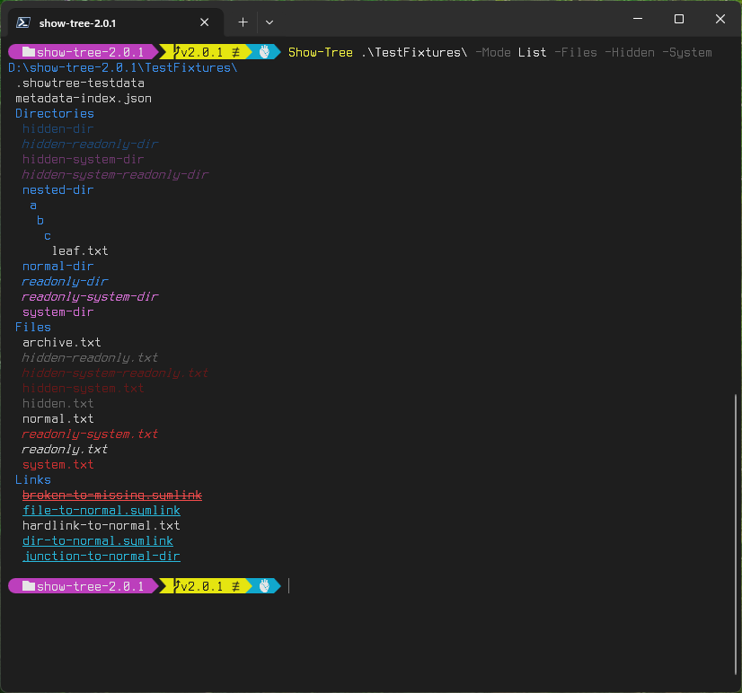
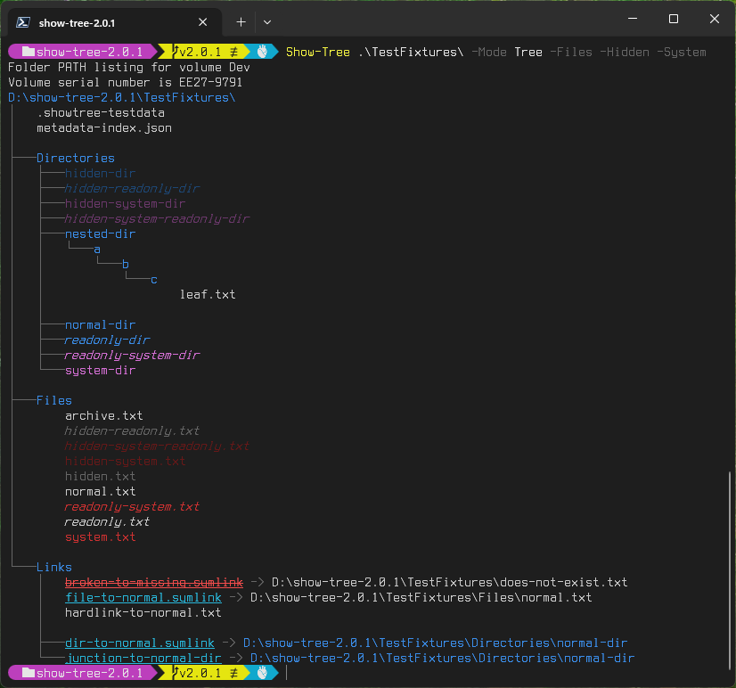
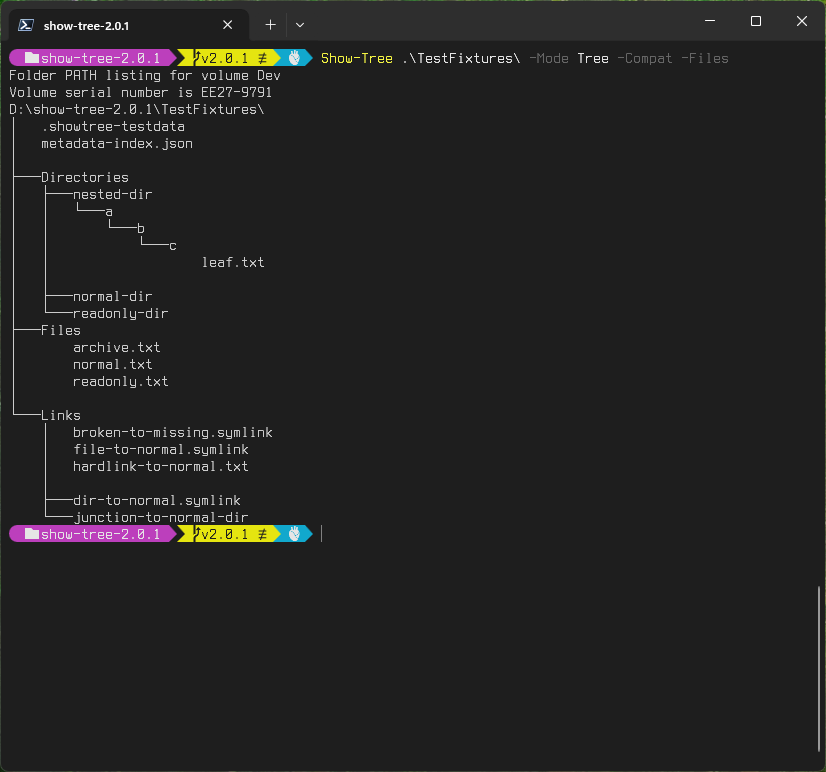
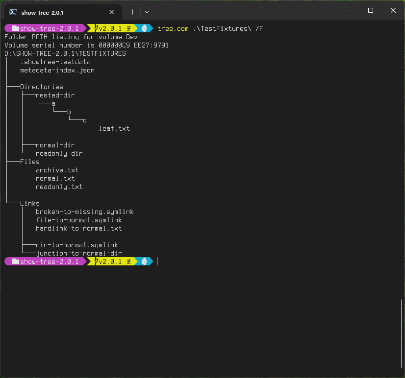
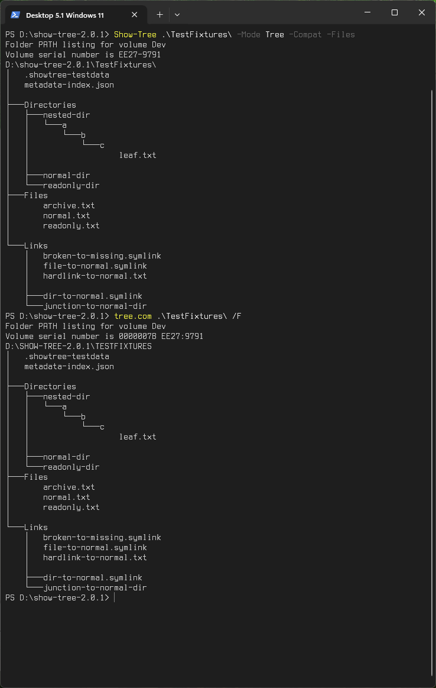
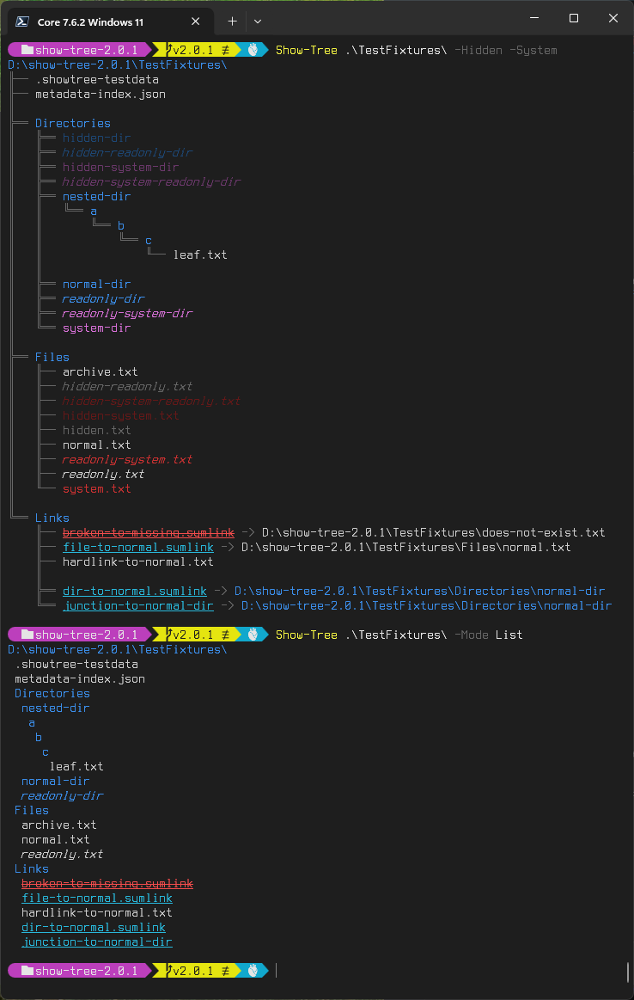
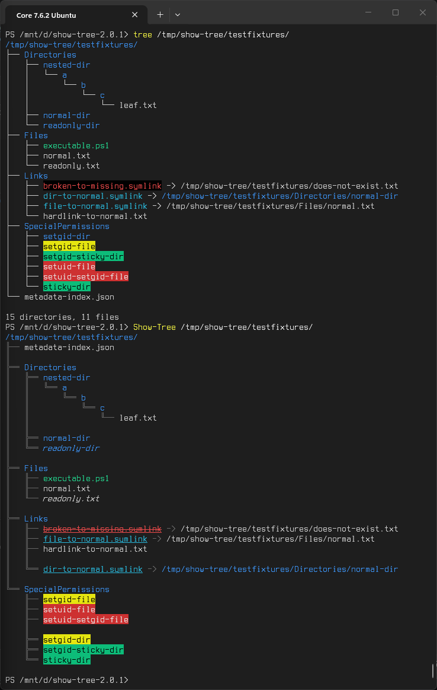

# ShowTree

[](https://www.powershellgallery.com/packages/ShowTree)
[](https://www.powershellgallery.com/packages/ShowTree)

A modern, PowerShell-native replacement for the classic `tree.com` command — redesigned for clarity, correctness, and modern workflows.

Show-Tree supports three distinct display modes:

- **Normal**: (Default) A clean, modern Unicode tree view with gap lines and rich styling.
- **Tree**: A legacy-compatible layout mimicking the classic `tree.com` utility, now enhanced with modern defaults like color and file support.
- **List**: A flat listing of items that retains hierarchical context.

---

## Why ShowTree?

`tree.com` hasn't changed since the 1990s — but your filesystem has.

ShowTree adds:

- **Cross-Platform Support**: Works on Windows (Desktop/Core) and Linux.
- **Localization**: Native support for multiple cultures (English, French, and Pseudo-Loc currently).
- **Style Profiles**: Extensible ANSI-based styling for file types and states (Hidden, Symlink, Executable, etc.).
- **Unicode Connectors**: Clean, readable output with ASCII fallback.
- **Color support**: Attribute-aware styling with a built-in legend.
- **Depth control**: Granular recursion control (`-MaxDepth`, `-Recurse`).
- **Filtering**: Glob-based include/exclude rules with exact-match precedence.
- **Reparse point detection**: Detects and displays targets for Junctions and Symlinks.
- **Gap logic**: Intelligently separates blocks for visual clarity.

All implemented in PowerShell with no external dependencies other than the .NET Framework for tree.com compatibility.

---

## Features

- Graphical Unicode tree with color syntax and clean connectors
- ASCII fallback for legacy environments
- Full `tree.com` compatibility mode (Windows only)
- Compact listing mode for scripts and automation
- Style Profiles via `Set-ShowTreeStyleProfile`
- Cultural localization support (`-Culture`)
- Reparse point target display (`-ShowTargets`)
- Works on NTFS, ReFS, FAT, ext4, and UNC paths

---

## Platform Support

PowerShell 5.1+ on Windows and PowerShell 7+ on Linux/macOS: Normal and Listing modes are expected to work, but cross-platform support is still being validated. Tree mode emulates low-level Windows `tree.com` behavior and is likely to only be supported on Windows.

| Platform                         | Normal mode | Listing mode | Tree mode | Tree mode (Compat) |
|----------------------------------|-------------|--------------|-----------|--------------------|
| Windows PowerShell 5.1 (Desktop) | Supported   | Supported    | Supported | Supported          |
| PowerShell 7+ on Windows (Core)  | Supported   | Supported    | Supported | Supported          |
| PowerShell 7+ on Linux (Core)    | Supported   | Supported    | Supported | Not supported      |
| PowerShell 7+ on macOS (Core)    | Supported   | Supported    | Supported | Not supported      |

---

## Screenshots

### Normal Mode

  

Normal mode is the standard way to use `Show-Tree`. It provides granular control and makes it a modern interpretation for `tree.com` for PowerShell.

### List Mode

  

List mode gives you a tight listing of the files and directories on a system. It benefits the most from having color enabled to see folders and files at a glance, and minimally shows the tree structure, making it an ideal mode for downstream processing.

### Tree Mode (modern)

  

Command line parameters give you a mode which retains the look and feel of a modern `tree.com` and leverages the rich parameters of `Show-Tree`.

### Tree Mode (legacy backwards compatibility)

  

Tree mode with the `-Compat` switch follows the output and error messages of `tree.com` very closely. `Show-Tree <Path> -Compat -Files` is the equivalient to `tree.com <Path> /F`.

### Comparison with `tree.com`



`tree.com` will follow all Junctions and Symlinks, and doesn't limit depth. By showing link targets and not following them, `Show-Tree` resolves one of the biggest problems with `tree.com` on modern systems, where `tree.com` can get stuck in an unlimited recursion.

## Wide platform support

### PowerShell Desktop 5.1 Windows 11

#### `tree.com` vs `Show-Tree` Compatible Tree mode



### PowerShell Core 7.6.2 Windows 11

#### `Show-Tree` Normal mode vs `Show-Tree` List Mode



### PowerShell Core 7.6.2 Ubuntu 20.04

#### `tree v2.1.1` vs `Show-Tree` Normal mode



---

## Usage

### Basic Examples

Display the current directory:

```powershell
Show-Tree
```

Unlimited depth:

```powershell
Show-Tree -Recurse
```

DOS `tree.com` compatible mode:

```powershell
Show-Tree -Mode Tree -Compat
```

ASCII connectors:

```powershell
Show-Tree -Ascii
```

Compact listing for scripting:

```powershell
Show-Tree -Mode List | Select-String src
```

Export to a file:

```powershell
Show-Tree C:\ -Mode List | Out-File listing.txt
```

### Style and Legend

```powershell
# Show the color legend for the current platform
Show-Tree -Legend

# Show the legend for all supported states (Windows + Unix)
Show-Tree -LegendAll

# Override culture for localized strings
Show-Tree -Culture fr-FR
```

Consult the [Parameter Summary table](#parameter-summary) for a complete list of parameters.

---

## Filtering (Include / Exclude)

ShowTree supports PowerShell-style glob filtering with well-defined precedence rules.
Exact Include always wins.
Exact Exclude always wins (even over glob Include).
Glob Include resurrects items removed by Hidden/System/Exclude (glob).
Hidden/System remove items unless resurrected.
Glob Exclude removes items unless resurrected.

### Exclude

```powershell
Show-Tree -Exclude pattern1, pattern2, ...
```

Removes matching items. Exact matches take precedence over Include globs.

### Include

```powershell
Show-Tree -Include pattern1, pattern2, ...
```

Selectively resurrects items removed by Hidden, System, or Exclude (glob).

### Precedence Rules

1. Exact Include always wins
2. Exact Exclude always wins (even over glob Include)
3. Glob Include resurrects items removed by Hidden/System/Exclude (glob)
4. Hidden/System remove items unless resurrected
5. Glob Exclude removes items unless resurrected
6. Items unaffected by any rule are kept

### Hide everything starting with a dot except `.vscode`

```powershell
Show-Tree -Exclude '.*' -Include '.vscode'
```

### Exclude `.git` exactly, but include `.gitignore`, `.github`, etc.

```powershell
Show-Tree -Exclude '.git' -Include '.git*'
```

### Hide hidden/system items but bring back `.config`

```powershell
Show-Tree -HideHidden -HideSystem -Include '.config'
```

---

## Parameter Summary

| Parameter                                       | Description                                                                                        |
|-------------------------------------------------|----------------------------------------------------------------------------------------------------|
| `‑Mode` <`Normal`\|`Tree`\|`List`>              | Selects the output mode. Defaults to `Normal`.                                                     |
| `‑MaxDepth` / `‑Depth`                          | Maximum recursion depth (`‑1` = unlimited). Defaults to `6`.                                       |
| `‑Recurse`                                      | Shortcut for unlimited depth.                                                                      |
| `‑Color` / `‑NoColor`                           | Force color on or off. Defaults to ON for modern modes including modern Tree mode.                 |
| `‑Files` / `‑NoFiles`                           | Control if files are shown. Defaults to ON for all modern modes.                                   |
| `‑Targets` / `‑NoTargets`                       | Show or hide reparse point targets. ON by default for `Normal` and `Tree` modes.                   |
| `‑Hidden` / `‑NoHidden`                         | Control visibility of hidden items. OFF by default.                                                |
| `‑System` / `‑NoSystem`                         | Control visibility of system items. OFF by default.                                                |
| `‑Exclude` <*pattern*> / `‑Include` <*pattern*> | Glob patterns that explicitly exclude or include items. Exact matches override all other filters.  |
| `-Gap` / `‑NoGap`                               | Control gap lines. Defaults to `Show` for `Normal` and modern `Tree` modes, and `None` for `List`. |
| `‑Compat`                                       | Enables strict legacy emulation for `‑Mode Tree` (Monochrome, folders-only, `tree.com` sorting).   |
| `‑Ascii`                                        | Use ASCII connectors instead of Extended ANSI or Unicode.                                          |
| `‑Legend`                                       | Show the style legend.                                                                             |
| `‑Platform` <`Current`\|`Windows`\|`Unix`>      | Preview another platform's states in legend (Windows/Unix).                                        |
| `-LegendAll`                                    | Show the style legend for all states.                                                              |
| `-Culture` <*bcp-47 language tag*>              | Override culture for localized strings.                                                            |

### Default Behaviors by Mode

Show-Tree applies different default settings based on the selected `-Mode` to optimize for each use case.

| Mode | Defaults applied |
| :--- | :--- |
| **Normal** | Color ON, Files ON, Targets ON, Gaps ON, Hidden/System OFF |
| **Tree** | Color ON, Files ON, Targets ON, Gaps ON, Hidden/System OFF |
| **List** | Color ON, Files ON, Targets OFF, Gaps OFF, Hidden/System OFF |
| **Compat** | Monochrome, Folders-only, Targets OFF, Gaps (Partial/Legacy) |

#### Gap Logic Quirks

In modern modes (**Normal** and **Tree**), gaps are deterministic and added between groups to improve readability.

In **Compatibility Mode** (`-Compat`), the gap behavior specifically mimics the original `tree.com` logic:

1.  **No Gaps**: Enabled via `-NoGap`.
2.  **Legacy Gaps**: (Default) Gaps only appear between directories and files. Note: Classic `tree.com` suppresses the final newline if the last item is a directory and this behavior is replicated with the `-Compat` switch.
3.  **Modern Gaps**: Enabled via `-Gap`. This overrides the legacy logic to use `Show-Tree`'s improved spacing, making it easier to distinguish directories at different nesting levels.

#### Strategic Choices

- **Hidden/System Items**: Disabled by default in all modes to match standard OS utility behavior (like `ls` or `dir`). Use `-Hidden` to include them.
- **Link Targets**: Enabled for modern views to provide maximum context, but disabled for **List** mode to maintain a high-density, flat visualization.

### Compatibility Mode

While `-Mode Tree` provides a modern take on the classic layout, you can use the `-Compat` switch to enable strict legacy emulation. This is useful for scripts or logs that require the exact output format of the original Windows utility:

```powershell
# Modern Tree view (Color, Files, and Targets enabled by default)
Show-Tree -Mode Tree

# Strict Legacy Emulation (Monochrome, Folders-only, Win32 sorting)
Show-Tree -Mode Tree -Compat
```

The `-Compat` switch is only valid when using `-Mode Tree`.

#### Notes about Compatibility Mode

It is also worth noting the slight differences between the classic `tree.com` and `Show-Tree -Mode Tree -Compat` output.

The Volume Serial Number for `tree.com` is a legacy program from the DOS era, and its output format was never updated to reflect modern Windows storage APIs. For this reason it generates two separate values, the high DWORD of the NTFS Volume ID, an internal filesystem identifier that modern Windows APIs do not expose, and the actual Win32 volume serial number, formatted as `HIGHWORD:LOWWORD`. `Show‑Tree` follows modern Windows conventions rather than reproducing `tree.com`’s legacy formatting.

The path for `tree.com` does not match the casing of the actual filesystem path. For `Show-Tree`, the path is displayed in the casing of the actual filesystem path.

To match the sorting behavior of `tree.com`, `Show-Tree` uses the Win32 API directly to read the filesystem information using the same API as `tree.com` and sorts the same way. All other modes use the PowerShell APIs providing cross-platform compatibility.

With these few exceptions, and especially in `-Ascii` mode, `Show-Tree` mimics `tree.com`’s output exactly, making it a drop-in replacement for `tree.com` in most cases.

---

## Documentation

For detailed information on usage, parameters, and examples, see the [Wiki](https://github.com/rbeesley/show-tree/wiki) or use `Get-Help Show-Tree -Full`.

### Technical Architecture

If you are interested in the internal design or wish to contribute to the project, please refer to our technical guides:

- [Core Architecture](docs/ARCHITECTURE.md): Design of the traversal and rendering engines.
- [Build System](docs/BUILD-ARCHITECTURE.md): Task-driven workflow and cross-version transpilation.
- [Test System](docs/TEST-ARCHITECTURE.md): Hash-based module caching and in-memory fixture trees.

---

## Installation

### From [PowerShell Gallery](https://www.powershellgallery.com/packages/ShowTree) (recommended)

```powershell
Install-Module ShowTree
```

PowerShell will auto-load the module when you run:

```powershell
Show-Tree
```

### From GitHub

Clone the repository and place the `ShowTree` folder into one of your module paths:

- Current user:  
`~/.local/share/powershell/Modules/` (Linux)  
`~/Documents/PowerShell/Modules/` (Windows)

- All users:  
`C:\Program Files\PowerShell\7\Modules\`

---

## Style Profiles

ShowTree v2.0 introduces a modular styling system. You can customize exactly how different file types and system states (like Hidden, Symlink, or Executable) appear in your terminal.

### 1. Creating a Custom Profile

Styles are defined using a nested hashtable. You only need to define the properties you want to change; everything else will fall back to the default profile.

```powershell
$myCustomStyle = @{
    # Base colors for the item Kinds
    Base = @{
        Directory = '95' # Light Magenta
        File      = '37' # White
    }
    # State-based overlays
    States = @{
        # Make executables Green and Bold (SGR 1)
        Executable = @{ 
            Foreground = @{ File = '92' }
            AnsiStyle  = '1' 
        }
        # Make hidden items Dim (SGR 2) and Italic (SGR 3)
        Hidden = @{ AnsiStyle = '2;3' }
    }
}
```

### 2. Applying Your Style

You can apply a style for the current session or a single command:

```powershell
# Option A: Set for the entire session
Set-ShowTreeStyleProfile -InputObject $myCustomStyle

# Option B: Use for a single command
Show-Tree -StyleProfile $myCustomStyle
```

### 3. Persisting Styles (Profiles)

To keep your styles across different PowerShell sessions, save your hashtable as a .psd1 file and load it in your PowerShell $PROFILE:

**MyStyle.psd1**

```powershell
@{
    Base = @{ Directory = '36' }
    States = @{ Symlink = @{ AnsiStyle = '4' } }
}
```

**Microsoft.PowerShell_profile.ps1**

```powershell
Set-ShowTreeStyleProfile -Path "C:\Path\To\MyStyle.psd1"
```

### State Styling Logic

ShowTree style profiles can define visual overlays for item states:

```powershell
States = @{
    Hidden = @{ AnsiStyle = '2' }
    System = @{
        Foreground = @{
            File      = '31'
            Directory = '35'
        }
    }
    Executable = @{
        Foreground = @{
            File      = '32'
            Directory = '36'
        }
        AnsiStyle = '1'
    }
}
```

`AnsiStyle` contains ANSI SGR parameters without the escape sequence wrapper. Multiple parameters may be separated with semicolons:

```powershell
States = @{
    Hidden = @{ AnsiStyle = '2' }      # Dim
    Symlink = @{ AnsiStyle = '4' }     # Underline
    BrokenLink = @{ AnsiStyle = '9' }  # Strikethrough
}
```

### Common states

| State               | Platform      | Meaning                                                                 |
|---------------------|---------------|-------------------------------------------------------------------------|
| `Hidden`            | Windows, Unix | Hidden file or directory. On Unix, names beginning with `.` are hidden. |
| `ReadOnly`          | Windows, Unix | Read-only item.                                                         |
| `System`            | Windows       | Windows system file or directory.                                       |
| `Temporary`         | Windows       | Temporary file.                                                         |
| `SparseFile`        | Windows       | Sparse file.                                                            |
| `ReparsePoint`      | Windows       | Reparse point, including symlinks and junctions.                        |
| `Compressed`        | Windows       | Compressed file or directory.                                           |
| `Offline`           | Windows       | Offline file.                                                           |
| `NotContentIndexed` | Windows       | Excluded from content indexing.                                         |
| `Encrypted`         | Windows       | Encrypted file or directory.                                            |
| `IntegrityStream`   | Windows       | Integrity stream attribute.                                             |
| `NoScrubData`       | Windows       | Data integrity scrubbing disabled.                                      |
| `Symlink`           | Windows, Unix | Symbolic link.                                                          |
| `BrokenLink`        | Windows, Unix | Symbolic link whose target cannot be resolved.                          |
| `Executable`        | Unix          | File with at least one execute permission bit.                          |
| `SetUid`            | Unix          | Set-user-ID permission bit.                                             |
| `SetGid`            | Unix          | Set-group-ID permission bit.                                            |
| `Sticky`            | Unix          | Sticky permission bit.                                                  |

### Additional native Windows attributes

ShowTree can also derive states from native Windows file attributes. These are supported for custom style profiles, but they are not styled by the default profile because they are usually too common or not visually useful.

| State     | Notes                                                                                                |
|-----------|------------------------------------------------------------------------------------------------------|
| `Archive` | Common on ordinary Windows files. Styling it usually affects almost everything.                      |
| `Normal`  | Means no other file attributes are set. Usually better represented by the base file/directory style. |
| `Device`  | Reserved by Windows. Rarely useful for styling.                                                      |

Example:

```powershell
States = @{
  Archive = @{ AnsiStyle = '2' }
  Normal  = @{ AnsiStyle = '90' }
}
```

### Base Styles vs States

Use `Base` for what an item is:

```powershell
Base = @{
  File      = '37'  # White
  Directory = '36'  # Cyan
}
```

Use `States` for traits. If a state defines a `Foreground` for a specific kind, it overrides the `Base` color:

```powershell
States = @{
# Directories marked 'System' will be Magenta (35) instead of Cyan (36)
  System = @{
    Foreground = @{
      File      = '31'
      Directory = '35'
    }
  }
}
```

`Directory` and `File` are kinds, not states, so they belong under `Base`, not `States`.

---

## Development Support

The bootstrap process will install the required dependencies for building and testing the project.

```powershell
.\build.ps1 -Bootstrap
```

### Build

Install InvokeBuild 5.14.23 or better (this is handled by the build bootstrap):

```powershell
Install-Module -Name InvokeBuild -Force -MinimumVersion 5.14.23
```

#### Available Build Tasks

The build system uses `Invoke-Build`. You can run these via `.\build.ps1 -Task <TaskName>`.

| Task | Dependencies | Description |
| :--- | :--- | :--- |
| **`Test`** | `ValidateManifest` | **(Default)** Validates the manifest and runs the Pester unit test suite. |
| **`Build`** | `BuildIfNeeded` | Performs an incremental build. Only rebuilds `dist/` if source files have changed. |
| **`ForceBuild`** | `Clean`, `BuildDist` | Wipes the `dist/` folder and performs a complete rebuild from scratch. |
| **`TestAll`** | `Test`, `TestDist`, `TestDesktop` | Runs the full battery of tests: Unit tests, PS7 smoke tests, and Windows PowerShell 5.1 smoke tests. |
| **`BuildDist`** | `DiscoverPublicFunctions` | Internal task that handles file copying, transpilation for Desktop, and manifest generation. |
| **`Clean`** | *(None)* | Deletes the `dist/` folder and build artifacts. |
| **`UpdateManifest`**| `DiscoverPublicFunctions` | Updates the root `ShowTree.psd1` with the latest public function exports. |

> **Note**: To see the full task list and dependency tree directly from your terminal, run:  
> `Invoke-Build -File .\build\tasks.build.ps1 -Task ?`
 
The most basic build task is to build the project:

```powershell
.\build.ps1 -Task Build
```

---

### Testing

Install Pester 5.7.1 or better (this is handled by the build bootstrap):

```powershell
Install-Module -Name Pester -Force -MinimumVersion 5.7.1
```

The Pester Test Explorer extension for Visual Studio Code is useful for debugging and can be used to run the tests as well. In practice, I found that using F5 to start debugging with the Interactive Module Session, and then running the command you want from the embedded terminal is the most reliable way to get a full debugging experience. I recommend setting breakpoints, then pressing F5 to start the interactive session, and then running the command, as it seems like you won't hit breakpoints.

You can also run the tests from the command line and if you aren't debugging, that can often be a quicker way to iterate.

From the repo root, run:

```powershell
.\build.ps1 -Test [path]<TestName>[.Tests.ps1]
```

The path is optional as the build/test system will search for the test file in the `Tests` folder.

You can run all the tests and do a complete build, creating a distribution with this command:

```powershell
.\build.ps1 -Task TestAll
```

This is the recommended way to create a distribution, as it will always make sure the code is fully built, all tests pass, and it requires a full build to make sure that the PowerShell Desktop version has been built.

---

## Contributing

Contributions are welcome! If you're looking to help improve ShowTree, please check out the [Architecture Guide](docs/ARCHITECTURE.md) for an overview of how the project is structured.

### Reporting Issues

Please use the [GitHub Issue Tracker](https://github.com/rbeesley/show-tree/issues) to report bugs or request features.

---

## License

This project is licensed under the MIT License. See the [LICENSE](LICENSE) file for details.

---

## Author

**Ryan Beesley**  
Version 2.0.1  
July 2026

A modern, extensible reimplementation of the classic `tree.com` utility — with graphical output, automation-friendly modes, and a fully PowerShell-native design.
